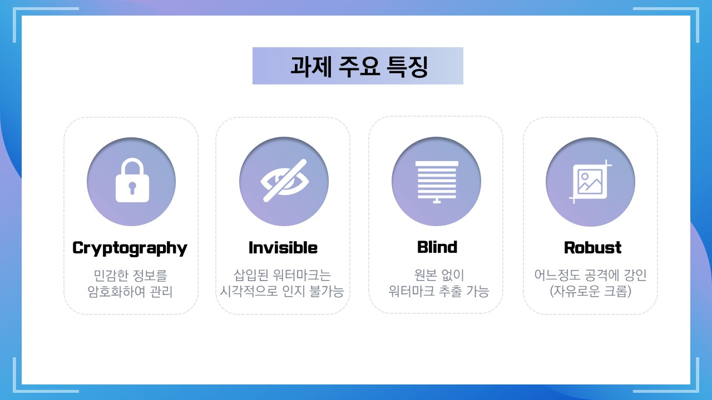
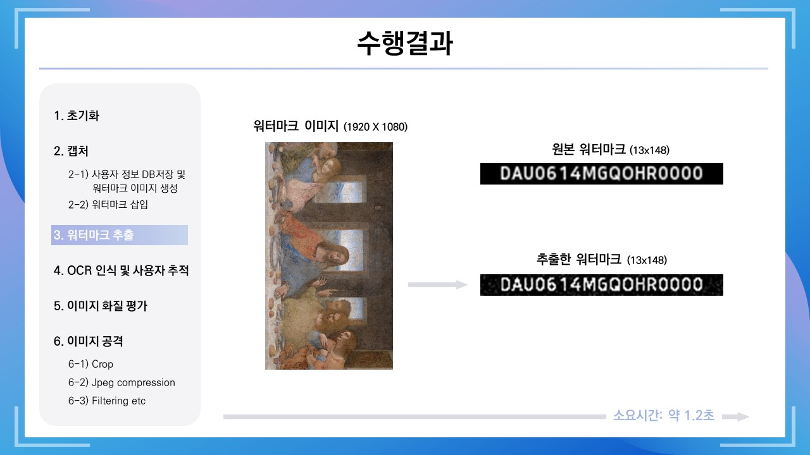
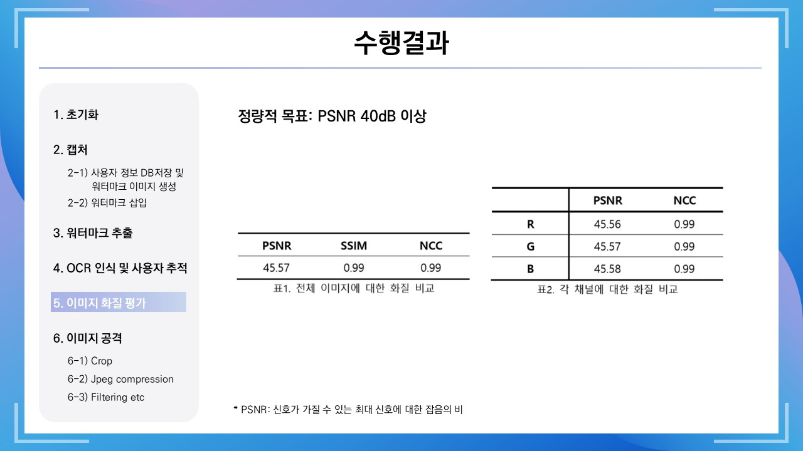

# Screen capture system for digital image copyright protection (Capstone design 2020-2)

## Overview   
* Needs, problems    
한국저작권보호원에 따르면 모바일 앱을 통한 불법복제는 2014년부터 계속 증가하는 추세를 보이며, 2017년을 기준으로 출판 중 웹툰 분야에서의 피해액은 약 2000억원 수준에 이르렀다. 현재는 앱 자체에서 스크린 캡쳐를 방지하는 기술을 적용되어있지만 전용 앱을 사용하지 않고 웹사이트에 접근하면 자유롭게 캡쳐가 가능하다는 맹점을 가진다.

* Goals, objectives (evaluation)    
 특정 웹사이트에서 스크린 캡처를 하면 해당 이미지에 보이지 않도록 사용자의 정보를 찾을 수 있는 특정 코드가 암호화되어 삽입되는 디지털 핑거프린팅 방식을 제안하고자 한다.

## Schedule   
1) 암호화와 이미지 프로세싱 및 핑거프린트 삽입 기술에 대해 연구한다.
2) 연구를 바탕으로 사용자 개인정보를 암호화하여 저장한다.
3) 개인정보를 찾을 수 있는 워터마크를 비가시적으로 이미지에 삽입한다. 
4) 캡처 시 효율적으로 핑거프린트를 삽입하며, 이미지 훼손에도 정보를 추출할 수 있도록 성능을 향상시킨다.

|Date|Contents|Progress|
|:--------|:------------------------------------:|:-------------:|
|0330|연구계획서 작성 및 최종제출||
|0406|암호화 기법 연구 및 세부 구성 수정|[PDF](doc/0408.pdf)|
|0413|AES 알고리즘 작성||
|0420|워터마킹 논문 서칭||
|0427|워터마킹 논문 서칭/컬러 이미지 분해 및 윤곽선 검출||
|0504|오픈소스 서칭 및 참조-핑거프린트 삽입||
|0511|오픈소스 서칭 및 참조-핑거프린트 삽입||
|0518|오픈소스 서칭 및 참조-이미지 워터마크 삽입||
|0525|임시 DB구축/워터마크 생성/워터마크 삽입 및 추출/기존 코드 문제점 확인||
|0601|기존 코드 문제점 개선/OCR 글자 인식/원본과 삽입 이미지 간 PSNR,SSIM,NCC 확인||
|0608|전체 과정 시뮬레이션/이미지 공격 후 워터마크 추출||

## Results
***모든 이미지는 [픽사베이](https://pixabay.com/)에서 제공하는 상업적 무료 이미지를 사용하였습니다.**  
***워터마크 이미지 생성 시 [나눔스퀘어](https://hangeul.naver.com/2017/nanum)폰트를 이용하였습니다.**

## Conclusion
1) 불법으로 유출된 이미지에 삽입되어있는 워터마크를 추출해 유출자를 찾는다.
2) 저작권 보호가 필요한 사이트/어플에서만 이 기능이 활성화되도록 유지하여 사용자가 디바이스 사용에 불편함이 없도록 한다.

## Reports
<!--* Upload or link (e.g. Google Drive files with share setting)-->
<!--* Midterm: [Report](Reports/Midterm.pdf)-->
Final: [Report](doc/최종보고서.pdf)
